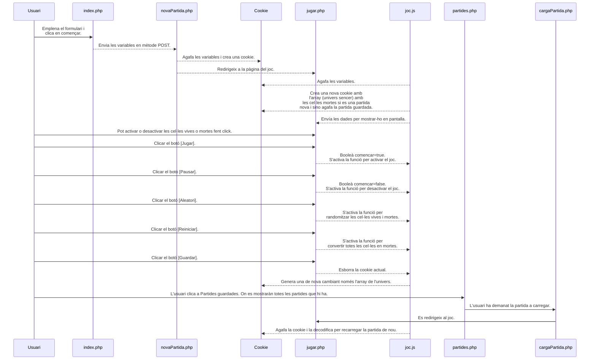

# Game Of Life 👨‍🚀

Primer projecte del segón curs del Cicle Superior de Desenvolupament d'Aplicacions Web a l'Institut Cendrassos.

## Construit amb... 🛠️

* [Visual Studio Code](https://code.visualstudio.com/) - IDE utilizado.

## Planificació ✔️

1. Wireframe básic
2. Esquelet CSS i HTML
3. Exemple visual del joc en Javascript
4. Formulari PHP
5. Unir PHP amb Javascript
6. Crear cookies
7. Fer proves del joc i trobar errors
8. Revisar errores i sol·luciona-los
9. Afegir detalls visuals
10. Separar header i footer
11. Finalitzar documentació i README

## Recursos 🌿

* [The Game of Life Using JavaScript](https://javascript.plainenglish.io/the-game-of-life-using-javascript-fc1aaec8274f) - Tutorial de com fer el joc en javascript.
* [Plantilla README](https://gist.github.com/Villanuevand/6386899f70346d4580c723232524d35a) - Plantilla README en espanyol, feta per @Villanuevand.
* [Joc de la vida](https://ca.wikipedia.org/wiki/Joc_de_la_vida) - Viquipèdia del Joc de la vida on explica les regles, patrons i origen del joc.

## Diagrama de casos d'us 🧭

```mermaid
sequenceDiagram
Usuari ->> index.php: Emplena el formulari i<br> clica en començar.
index.php -->> novaPartida.php: Envia les variables en mètode POST.
novaPartida.php -->> Cookie: Agafa les variables i crea una cookie.
novaPartida.php -->> jugar.php: Redirigeix a la pàgina del joc.
joc.js -->> Cookie: Agafa les variables.
joc.js -->> Cookie: Crea una nova cookie amb<br>l'array (univers sencer) amb<br>les cel·les mortes si es una partida<br>nova i sino agafa la partida guardada.
joc.js -->> jugar.php: Envía les dades per mostrar-ho en pantalla.
Usuari ->> jugar.php: Pot activar o desactivar les cel·les vives o mortes fent click.
Usuari ->> jugar.php: Clicar el botó [Jugar].
jugar.php -->> joc.js: Booleà comencar=true.<br>S'activa la funció per activar el joc.
Usuari ->> jugar.php: Clicar el botó [Pausar].
jugar.php -->> joc.js: Booleà comencar=false.<br>S'activa la funció per desactivar el joc.
Usuari ->> jugar.php: Clicar el botó [Aleatori].
jugar.php -->> joc.js: S'activa la funció per <br>randomitzar les cel·les vives i mortes.
Usuari ->> jugar.php: Clicar el botó [Reiniciar].
jugar.php -->> joc.js: S'activa la funció per <br>convertir totes les cel·les en mortes.
Usuari ->> jugar.php: Clicar el botó [Guardar].
jugar.php -->> joc.js: Esborra la cookie actual.
joc.js -->> Cookie: Genera una de nova cambiant només l'array de l'univers.
Usuari ->> partides.php: L'usuari clica a Partides guardades. On es mostraràn totes les partides que hi ha.
partides.php ->> cargaPartida.php: L'usuari ha demanat la partida a carregar. 
cargaPartida.php ->> jugar.php: Es redirigeix al joc.
joc.js -->> Cookie: Agafa la cookie i la decodifica per recarregar la partida de nou.

```

## Autor ✒️

* **@sleyvenn (Adrián Pons)**

## Gràcies 🎁

Agraeixo tota l'ajuda que m'han proporcionat els professors i companys del cicle per tal de poder assolir els objectius del projecte. 
Ha sigut un projecte en el cual m'he introduït en els llenguatges php i javascript, dels quals encara no tenía cap coneixement. En tres semanes he hagut d'assolir els conceptes bàsics i claus per tal de crear el projecte. 
Ha estat una experiència molt interessant, que he disfrutat i patit molt. Però sobretot, m'ha permés trencar molts murs que pensaba que hi tenía davant meu respecte a l'aprenentatge de programació i entendre com funcionen diferents llenguatges que mai havía utilitzat.
